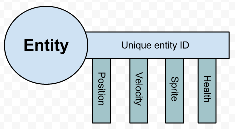
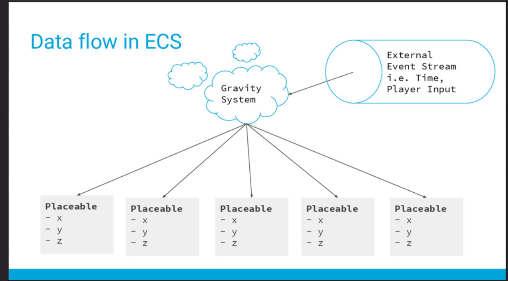
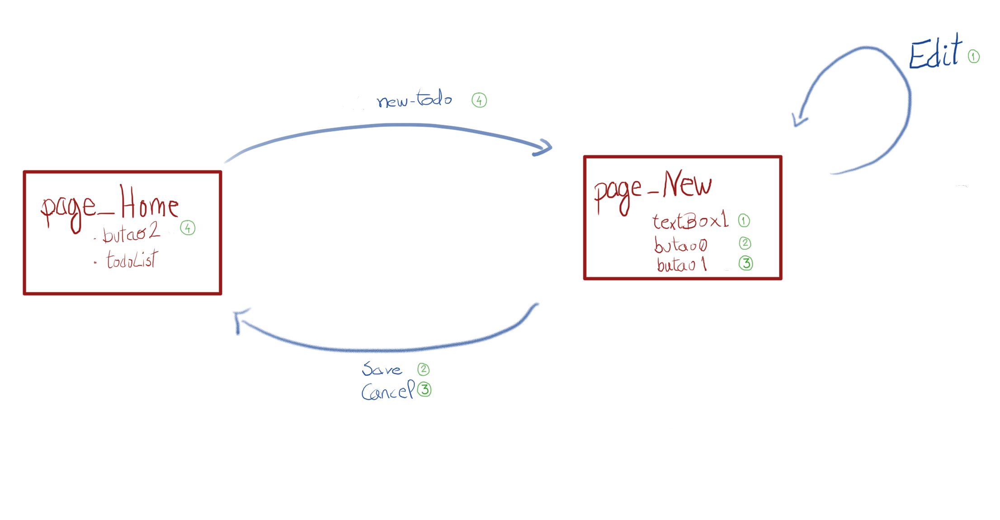
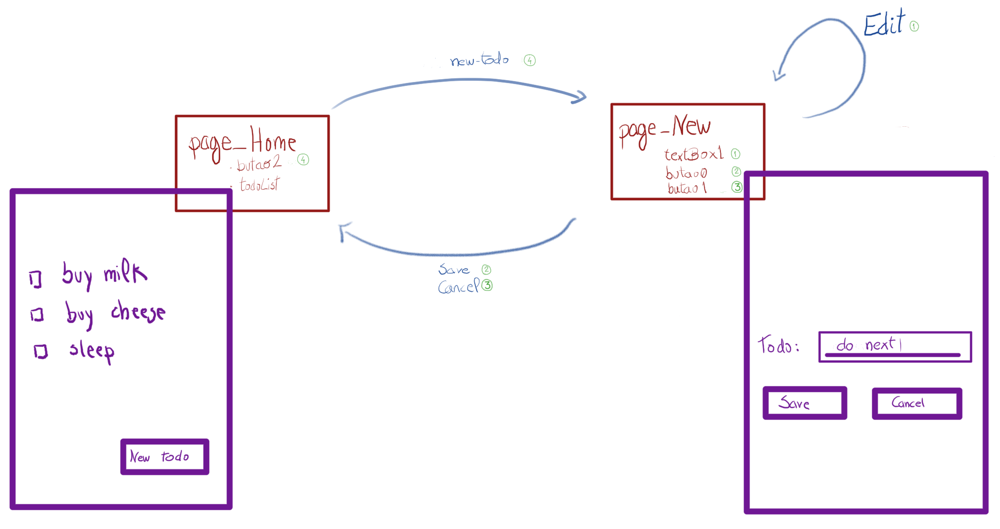

#Manifest

The four dogmas of the web programmer:
- ####Components
When a programmer see a web page tries to map what he sees with his mental 
model of the program and programer ways. So he use the same techniques and 
imagines little boxes and calls that components. A consequence of this is 
the cascading divs.Then came all the stuff of OO.
- ####loop
Many programers now days sees thats there is a loop in the interaction between
program and user(we can see this in many "reactive" web frameworks ).
But the programer is run in a web browser and the browser has it's own loop. So
we end up with two concurrent loops.
- ####css
It's a global place where you put a bunch of declarations about how the programmers
wants it to look. But once again there is the browser, that will take that information
and apply on top its own rules, before showing the result to the user.
CSS give a indirect control over the result, so the programmer has to guess what the browser
will do.
- ####routing
Browser have an address bar that is standard way that the user uses it. In principle that has 
nothing to do with the program that was made. But the bar started to be used as a drop
place of information between the server and the program running in the browser.
 Rapidly this became a way of storing the application progress with several frameworks.
 
 ##My View
Instead of using the loaded word components I will use the word entity refering to 
"things" that are display on the screen and also to "things" related to the application
 model.

Go chanel:

    (def inputA (chan))
 
Example of a action associated width a button:
            
    :on-click (fn [e]
                 (put! inputA {:action "Save"
                               :msg "message Save "
                               :type "Button"
                               }))

All actions are allways like that( ahead I will show actions can be
generated automaticaly). Actions are identified and don't alter anything in the app.
 For example I never do anything like this :
        
        :on-click #(remove-todo! td)
                       
Everything is an action, so I would do instead :

        :on-click # (put! inputA {:action "remove-todo" })

The Loop now looks like this:
    
    (go
      (loop []
            (rum/mount (todo-list st1 ) (.getElementById js/document "app"))
            (let [val (<! inputA)]
                 (case (:action val)
                   "Save"     (print "****Save***")
                   "new-todo" (print "***new-todo****")
                   (print (:action val)))
                 (recur))))
                 
So the rendering part has no logic, the only side effect is putting a "action" in the chanel.It's powerless 
side effect with delayed consequences.
Is in the app loop that the consequences of the actions are realized. 
    Now this looks like old text adventures games
where the games stops and waits for the player input (action).
 
- *ref http://gameprogrammingpatterns.com/game-loop.html

## State

State and state machine

    (go
      (loop [stat st0]
            ;render
            (rum/mount (todo-list stat ) (.getElementById js/document "app"))
        
            ;state Machine
            (let [input (<! inputA)
                  _action (:action input)
                  _page   (:page   stat)]
                 (case _page
                       "Home" (case _action
                                    "new-todo" (recur (assoc (assoc-in stat [:page] "New"):mode :add-todo-form))
                                    (recur stat)
                                    )
                       "New" (case _action
                                  "Save"     (recur (dissoc (assoc-in stat [:page] "Home") :mode ))
                                  "Cancel"   (recur (dissoc (assoc-in stat [:page] "Home") :mode ))
                                  (recur stat)
                                  )
                       (recur stat)
                       )
                 )
            ))
            
Lets be formal

|entitiyID      | Clickable (Actions)| HTML                                                                                   |  todos                                       |  route                       |      |
|---------------|-----------        |---------------------------------------------------------------------------------------- |----------------------------------------------|-----                         | -----|
|page_Home      |                   |{type: "home-page"  :layout [butao2 todoList]   :label "Home"  }                         |                                              |                              |
|page_New       |                   |{type: "modal-form" :layout [textBox,butao0,butao1] :background :page_Home :label "New"} |                                              |                              |     |
|todo0          |"Edit"             |{type: "line-todo"  }                                                                    | {:content "buy milk"  :completed false}      |                              |                                              |              |
|todo1          |"Edit"             |{type: "line-todo"  }                                                                    | {:content "buy cheese" :completed false}     |                              |                                              |              |
|butao0         |"Cancel"           |{type:  "btn-primary" :label "Cancel"}                                                   |                                              |                              |
|butao1         |"Save"             |{type: "btn-primary"  :label "Save"}                                                     |                                              |                              |
|butao2         |"new todo"         |{type: "btn-primary"  :label "new todo"}                                                 |                                              |                              |
|todoList       |                   |{type: "table-todo"}                                                                     |{:list [todo0,todo1] }                        |                              |
|textBox        |"todo text"        |{type: "table-todo"}                                                                     |                                              |                              |
|current_Page   |                   |                                                                                         |                                              | {:page :page_Home }  |                                                           |    

Clickable
 actions -> "Save" "Cancel" "new-todo" "Edit"

https://speakerdeck.com/yosriady/entity-component-systems

At this point you can trigger(dispatch) an action (or many) from the repl:
        
        (put! inputA  {:action "new-todo" :msg "msssg "})

## physics engine

Generaly HTML gets mixed with "business logic" in most frameworks
                 
                 Selector                    action
    (click-chan "#example1 a.new-todo"        :new-todo)

# sumary
usualy frameworks uses convention, you use framework you change parts in acordance to instrutions
not knowing exatly how it works under the hood.

I used concepts as rendering(html using react), event-sourcing, go-chanel,ecs and these are visible in the
code. The advantage (in web devel) is that a team is designers , programers and buisness.
So if the code is divided by concepts is easier to see what parts
are important for each elements of the team and the impact it has on the other parts.
Also is easy to replace parts, for example the rendering part for a speech interface.